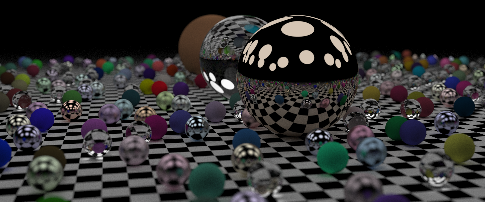
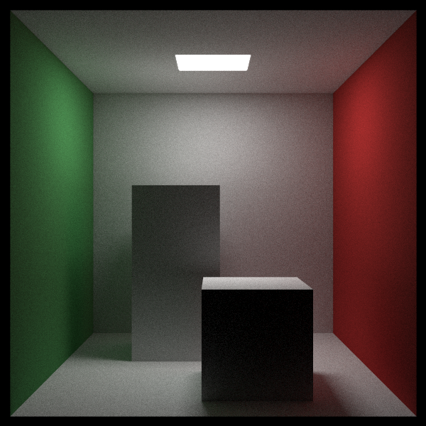

# ray-tracer

A ray tracer implemented in Rust.

Run `cargo run --release -- --help` for details.

```
cargo run --release -- --height 1000 --width 2390 --samples 10000 --scene spheres
```


```
cargo run --release -- --height 600 --width 600 --samples 10000 --scene cornell-box
```

